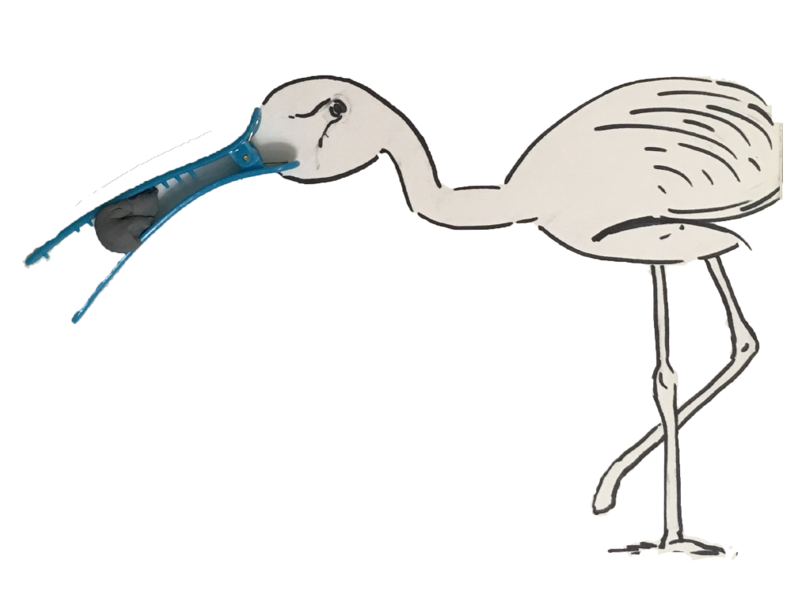
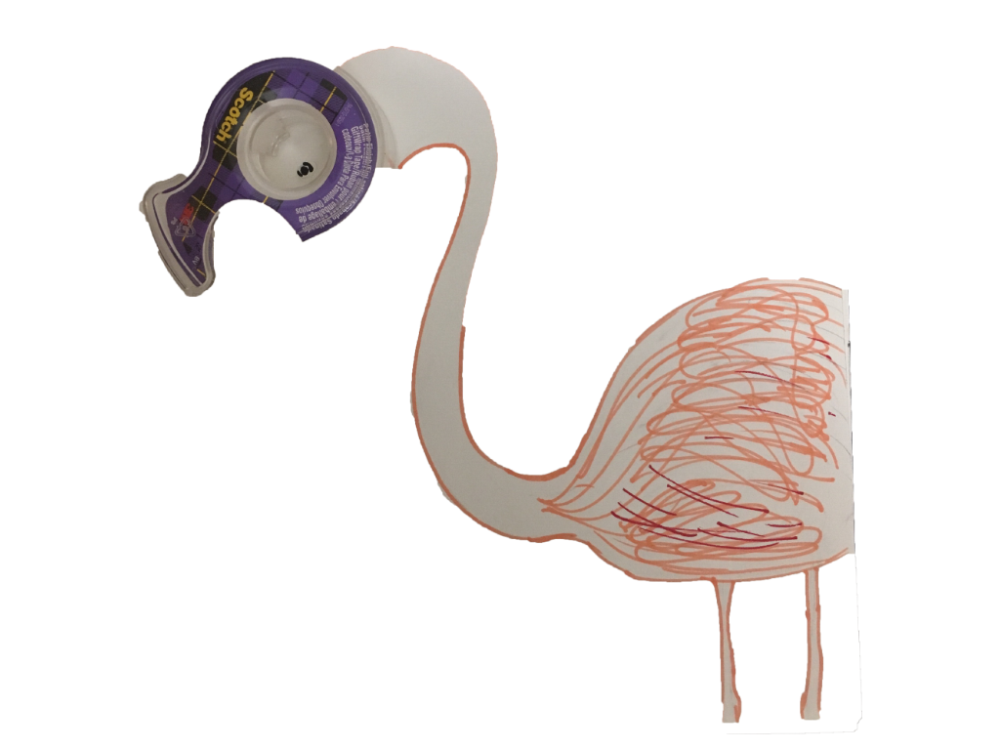
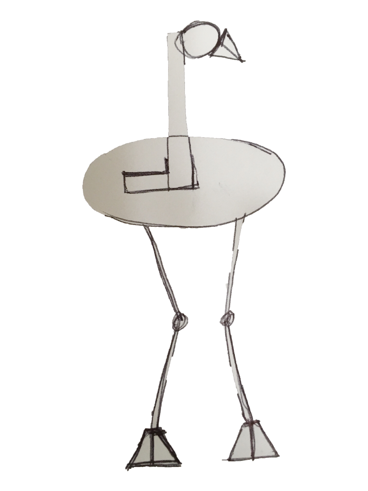

# Abstractions

This section is a part of the _flamingo Project_.

As I tried to desperately think of concepts to draw the bird, motivation struck by simply taking time to look around! 

After scouring through household objects, I came across this pair of kitchen pincers that reminded me of of a bird in flight. All I had to do was add a beak and a set of wings to set the bird in motion.

 

Yes! You guessed that right! Thats a 'Duck- teeth' hairclip which formed the beak of my flamingo. Used some kneeded eraser as its food. :)

 

Can you think of anything better to represent the head other than the scotch tape? It fits perfectly doesn't it? 

 

How about a very basic Skeleton using just Geometric Shapes?

