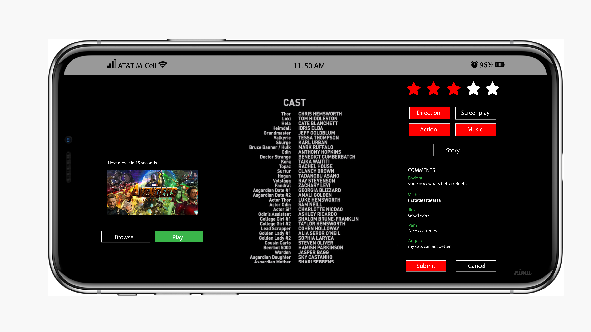

## The Project

I worked on this project to help my friend in his coursework for the subject: Human-Computer Interaction.
   
The redesign of the app was focused mainly to increase the 'searchability' factor which allowed users to discover the content they were looking for more efficiently. 

This app also encourages users to describe their viewing experience by adding in-built comments and rating section to help the app better its algorithm and suggest content based on the users' preference.

You can find some of the suggested changes in the pictures below.

In case you missed it, Check out the comments section in the final image for some [The Office](https://www.imdb.com/title/tt0386676/) references.  

Also, major shout-out to all *Office* fans!! 

I will shortly link the original assignment _here_. 